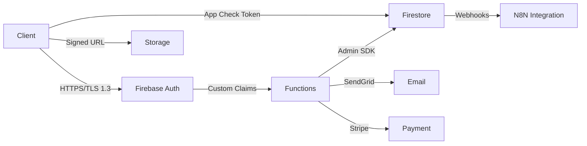

# Analyse BMAD - Sentinel GRC v2.0

**Date:** 2026-01-09
**Méthodologie:** BMAD (Business, Métiers/Actors, Assets/Données, Dependencies)
**Auditeur:** Claude (Anthropic)
**Version de l'application:** 2.0

---

## 📋 Résumé Exécutif

### Vue d'ensemble
Sentinel GRC v2.0 est une plateforme professionnelle de gestion de la sécurité des systèmes d'information (SSI) conforme aux normes ISO 27001 et ISO 27005. L'application présente une architecture moderne et robuste avec des fondations de sécurité solides.

### Score de Sécurité Global: 7.5/10

**Points Forts:**
- ✅ Architecture multi-tenant sécurisée
- ✅ RBAC granulaire et bien implémenté
- ✅ Firestore Security Rules complètes
- ✅ App Check avec ReCaptcha Enterprise
- ✅ Chiffrement des données sensibles
- ✅ Logging et monitoring structurés

**Points d'Amélioration Identifiés:**
- ⚠️ Absence de rate limiting explicite
- ⚠️ Gestion des sessions à améliorer
- ⚠️ Headers de sécurité CSP manquants
- ⚠️ Validation des entrées côté client à renforcer
- ⚠️ Absence de détection d'anomalies

---

## 🎯 B - Business (Modèle d'Affaires)

### Objectif de l'Application
Sentinel GRC est une plateforme SaaS B2B dédiée à la gestion de la conformité ISO 27001/27005 pour les organisations. Elle permet de centraliser la gestion des actifs, des risques, des audits, des documents et des projets de sécurité.

### Modules Fonctionnels

| Module | Description | Criticité | Données Sensibles |
|--------|-------------|-----------|-------------------|
| **Gestion des actifs** | Inventaire et classification des actifs | ⭐⭐⭐ | Oui (Configuration système) |
| **Gestion des risques** | Évaluation ISO 27005 | ⭐⭐⭐⭐⭐ | Oui (Vulnérabilités) |
| **Gestion des audits** | Planification et rapports | ⭐⭐⭐⭐ | Oui (Non-conformités) |
| **Gestion documentaire** | Versionning et workflow | ⭐⭐⭐⭐ | Oui (Politiques) |
| **Projets SSI** | Suivi et jalons | ⭐⭐⭐ | Non |
| **Conformité ISO 27001** | Tableaux de bord SoA | ⭐⭐⭐⭐⭐ | Oui (Preuves) |
| **Gestion des incidents** | Suivi des incidents de sécurité | ⭐⭐⭐⭐⭐ | Oui (Incidents) |
| **Threat Intelligence** | Veille des menaces | ⭐⭐⭐⭐ | Oui (CVE, Menaces) |
| **Gestion des fournisseurs** | Évaluation tiers | ⭐⭐⭐ | Oui (Contrats) |
| **Business Continuity** | Plan de continuité | ⭐⭐⭐⭐ | Oui (PCA/PRA) |

### Modèle de Revenus
- **SaaS par abonnement** avec 3 plans (Discovery, Professional, Enterprise)
- **Facturation mensuelle/annuelle** via Stripe
- **Multi-tenant** avec isolation complète des données

### Conformité Réglementaire
- ✅ ISO 27001 / ISO 27005
- ✅ RGPD (Processing Activities, Legal Basis)
- ✅ SOC 2 (Audit trails, Logging)
- ⚠️ ANSSI (Documentation à compléter)

---

## 👥 M - Métiers/Actors (Acteurs)

### Matrice des Rôles et Permissions

| Rôle | Niveau d'Accès | Permissions Clés | Risque |
|------|----------------|------------------|--------|
| **Admin** | Complet (manage *) | Toutes les opérations, gestion utilisateurs, configuration | ⚠️ ÉLEVÉ |
| **RSSI** | Étendu | Gestion complète des actifs, risques, projets, audits, incidents | ⚠️ ÉLEVÉ |
| **Auditeur** | Lecture + Audits | Création/modification d'audits, lecture seule ailleurs | 🟢 MOYEN |
| **Chef de Projet** | Projets + Docs | Gestion complète des projets, lecture ailleurs | 🟢 MOYEN |
| **Direction** | Lecture seule | Vue d'ensemble, tableaux de bord, rapports | 🟢 FAIBLE |
| **Utilisateur** | Très limité | Lecture limitée, création d'incidents | 🟢 FAIBLE |

### Ségrégation des Rôles (SoD)

✅ **Bien implémenté:**
- Admin ≠ RSSI (séparation des pouvoirs)
- Auditeur ≠ Project Manager (indépendance)
- Direction en lecture seule (oversight)

⚠️ **À surveiller:**
- L'Admin a un pouvoir complet sans validation secondaire
- Pas de validation 4-eyes pour les opérations critiques (suppression de risques, etc.)
- Les propriétaires d'organisation (orgOwner) ont les mêmes droits qu'Admin

### Custom Roles
✅ Support des rôles personnalisés avec matrice de permissions configurable
⚠️ Validation à renforcer pour éviter l'escalade de privilèges

---

## 💾 A - Assets/Données (Actifs et Données)

### Classification des Données

#### Données Hautement Sensibles (Confidential)
| Type | Localisation | Chiffrement | Rétention |
|------|--------------|-------------|-----------|
| Identifiants utilisateurs | Firestore `/users` | ❌ (Firebase Auth) | Illimitée |
| Tokens de session | Firebase Auth + Firestore | ✅ (JWT) | 1 heure |
| Clés d'intégration | Firestore `/integrations` | ⚠️ (Partiel) | Illimitée |
| Mots de passe | Firebase Auth | ✅ (bcrypt) | Illimitée |
| Données de paiement | Stripe (external) | ✅ (PCI-DSS) | N/A |
| Documents sensibles | Firebase Storage | ❌ | Illimitée |

#### Données Sensibles (Internal)
| Type | Localisation | Chiffrement | Rétention |
|------|--------------|-------------|-----------|
| Risques et vulnérabilités | Firestore `/risks`, `/vulnerabilities` | ❌ | Illimitée |
| Actifs critiques | Firestore `/assets` | ❌ | Illimitée |
| Incidents de sécurité | Firestore `/incidents` | ❌ | Illimitée |
| Audits et findings | Firestore `/audits`, `/findings` | ❌ | Illimitée |
| Fournisseurs | Firestore `/suppliers` | ❌ | Illimitée |

#### Données Publiques (Public)
| Type | Localisation | Chiffrement | Rétention |
|------|--------------|-------------|-----------|
| Menaces globales | Firestore `/threats` (global) | ❌ | 90 jours |
| Documentation publique | Firebase Storage `/public` | ❌ | Illimitée |

### Stockage des Données

```
Firebase Cloud Firestore (Primary Database)
├── Multi-region: us-east1
├── Persistent Cache: IndexedDB (client-side)
├── Backup: Manual + Scheduled (Firebase Functions)
└── Encryption: At-rest (Google-managed), In-transit (TLS 1.3)

Firebase Cloud Storage (Object Storage)
├── Buckets: sentinel-grc-a8701.appspot.com
├── Files: Documents, images, exports
├── Access: Signed URLs + Storage Rules
└── Encryption: At-rest (Google-managed)

Firebase Authentication (Identity)
├── Providers: Email/Password, Google, Apple
├── Custom Claims: role, organizationId, superAdmin
├── Session: JWT tokens (1h expiration)
└── MFA: ⚠️ Non implémenté

Client-Side Storage
├── LocalStorage: Theme, preferences, cache
├── IndexedDB: Firestore offline cache
└── SessionStorage: Temporary data
```

### Flux de Données Critiques



### Politiques de Rétention

⚠️ **Problème identifié:** Absence de politique de rétention automatique
- Aucune suppression automatique des données anciennes
- Logs système conservés indéfiniment
- Pas de mécanisme d'archivage

**Recommandation:** Implémenter une politique de rétention selon ISO 27001 et RGPD

---

## 🔗 D - Dependencies (Dépendances)

### Services Cloud Critiques

| Service | Provider | Usage | SLA | Criticité |
|---------|----------|-------|-----|-----------|
| **Firebase Auth** | Google Cloud | Authentification | 99.95% | ⚠️ CRITIQUE |
| **Firestore** | Google Cloud | Base de données | 99.95% | ⚠️ CRITIQUE |
| **Cloud Storage** | Google Cloud | Fichiers | 99.95% | ⚠️ CRITIQUE |
| **Cloud Functions** | Google Cloud | Backend serverless | 99.5% | ⚠️ CRITIQUE |
| **SendGrid** | Twilio | Emails transactionnels | 99.9% | 🟡 IMPORTANT |
| **Stripe** | Stripe Inc. | Paiements | 99.99% | 🟡 IMPORTANT |
| **Sentry** | Sentry.io | Error tracking | 99.9% | 🟢 SECONDAIRE |
| **Google Gemini AI** | Google Cloud | IA générative | N/A | 🟢 SECONDAIRE |
| **ReCaptcha Enterprise** | Google Cloud | App Check | 99.9% | 🟡 IMPORTANT |
| **N8N Webhooks** | Auto-hébergé | Intégrations | N/A | 🟢 SECONDAIRE |

### Dépendances NPM Critiques

#### Frontend (package.json)
```json
{
  "react": "^19.0.0",
  "firebase": "^11.2.0",
  "zustand": "^5.0.3",
  "react-router-dom": "^6.28.0",
  "tailwindcss": "^3.4.1",
  "vite": "^6.0.3",
  "typescript": "^5.7.3",
  "dompurify": "^3.2.4",  // XSS Protection
  "crypto-js": "^4.2.0"    // Encryption
}
```

⚠️ **Vulnérabilités potentielles:**
- Dépendance à `crypto-js` pour le chiffrement (client-side, clé exposée)
- Versions de React/Vite très récentes (stabilité?)

#### Backend (functions/package.json)
```json
{
  "firebase-admin": "^13.0.2",
  "firebase-functions": "^6.3.1",
  "@sendgrid/mail": "^8.1.5",
  "stripe": "^17.6.0",
  "nodemailer": "^6.9.18",
  "@google/generative-ai": "^0.21.0"
}
```

### APIs Externes

| API | Usage | Authentification | Rate Limit | Criticité |
|-----|-------|------------------|------------|-----------|
| **NVD (NIST)** | CVE Database | ❌ Public | Inconnu | 🟢 SECONDAIRE |
| **HIBP** | Breach detection | API Key | 1500/day | 🟢 SECONDAIRE |
| **Stripe API** | Paiements | Secret Key | N/A | 🟡 IMPORTANT |
| **SendGrid API** | Emails | API Key | 100/sec | 🟡 IMPORTANT |
| **Google Calendar** | Synchronisation | OAuth2 | 1M/day | 🟢 SECONDAIRE |

### Points Faibles des Dépendances

1. **SPOF (Single Point of Failure):** Firebase est le SPOF principal
2. **Vendor Lock-in:** Forte dépendance à Google Cloud
3. **Absence de fallback:** Pas de mécanisme de basculement si Firebase est indisponible
4. **Rate limiting externe:** Pas de contrôle sur les limites des APIs tierces

---

## 🔒 Analyse de Sécurité

### Évaluation par Couche

#### 1. Authentification et Autorisation: 8/10

**Forces:**
- ✅ Firebase Auth avec Multi-provider (Google, Apple, Email/Password)
- ✅ Custom Claims pour RBAC (role, organizationId, superAdmin)
- ✅ Firestore Security Rules complètes et granulaires
- ✅ Validation des permissions côté client et serveur
- ✅ Isolation multi-tenant stricte

**Faiblesses:**
- ❌ **MFA non implémenté** (critique pour Admin/RSSI)
- ⚠️ Pas de détection de sessions concurrentes suspectes
- ⚠️ Pas de limitation des tentatives de connexion (rate limiting)
- ⚠️ Tokens JWT valables 1h sans refresh intelligent
- ⚠️ Pas de logging des modifications de permissions

**Recommandations:**
1. **Implémenter MFA obligatoire** pour Admin/RSSI/Auditeur
2. Ajouter rate limiting sur les endpoints d'authentification
3. Implémenter session monitoring (détection de géolocalisation anormale)
4. Ajouter un mécanisme de refresh token sécurisé
5. Logger toutes les modifications de rôles/permissions

#### 2. Gestion des Données: 7/10

**Forces:**
- ✅ Encryption at-rest (Google-managed)
- ✅ TLS 1.3 pour encryption in-transit
- ✅ Service d'encryption pour données sensibles (EncryptionService)
- ✅ Validation des entrées dans Firestore Rules
- ✅ Backup manuel et automatisé

**Faiblesses:**
- ❌ **Clé de chiffrement côté client exposée** (VITE_ENCRYPTION_KEY dans .env)
- ❌ Pas de chiffrement end-to-end pour les documents sensibles
- ⚠️ Pas de rotation automatique des clés
- ⚠️ Absence de DLP (Data Loss Prevention)
- ⚠️ Pas de politique de rétention automatique

**Recommandations:**
1. **Migrer le chiffrement vers Cloud Functions** (server-side)
2. Implémenter un KMS (Key Management System) avec rotation
3. Ajouter chiffrement end-to-end pour documents critiques
4. Implémenter une politique de rétention RGPD-compliant
5. Ajouter watermarking pour les exports sensibles

#### 3. Validation des Entrées: 6.5/10

**Forces:**
- ✅ Validation Zod dans les formulaires
- ✅ Firestore Rules avec validation de format/longueur
- ✅ DOMPurify pour sanitisation HTML (SafeHTML component)
- ✅ Validation des fichiers (type, taille)

**Faiblesses:**
- ⚠️ **Validation côté client uniquement** pour certains champs
- ⚠️ Pas de validation centralisée des inputs
- ⚠️ Manque de sanitisation pour les exports (CSV, Excel, PDF)
- ⚠️ Pas de validation des URLs (SSRF possible)
- ⚠️ Absence de CSP headers stricts

**Recommandations:**
1. Centraliser la validation dans un service partagé (client/server)
2. Ajouter validation server-side systématique dans Cloud Functions
3. Implémenter CSP headers stricts
4. Ajouter validation et sanitisation des exports
5. Implémenter protection SSRF pour les intégrations

#### 4. Gestion des Sessions: 7/10

**Forces:**
- ✅ JWT tokens avec expiration (1h)
- ✅ Persistence configurée (indexedDB pour native, localStorage pour web)
- ✅ Déconnexion automatique à l'expiration
- ✅ App Check pour valider les requêtes

**Faiblesses:**
- ⚠️ Pas de détection de sessions concurrentes anormales
- ⚠️ Absence de session timeout configurable par rôle
- ⚠️ Pas de logout forcé en cas de changement de rôle
- ⚠️ Tokens non révoqués à la suppression d'utilisateur

**Recommandations:**
1. Implémenter session monitoring et alertes
2. Ajouter timeout configurable par rôle (Admin: 15min, User: 1h)
3. Forcer logout à la modification de rôle/permissions
4. Implémenter token revocation list (Redis ou Firestore)

#### 5. Logging et Monitoring: 7.5/10

**Forces:**
- ✅ ErrorLogger centralisé avec Sentry
- ✅ System logs immuables dans Firestore
- ✅ Auth audit logs pour les tentatives de connexion
- ✅ Firebase Analytics pour métriques
- ✅ Logs structurés (JSON)

**Faiblesses:**
- ⚠️ **Messages d'erreur trop verbeux** (information leakage)
- ⚠️ Absence de corrélation des événements de sécurité
- ⚠️ Pas d'alerting temps réel sur événements critiques
- ⚠️ Logs conservés sans limite (RGPD)

**Recommandations:**
1. Sanitiser les messages d'erreur en production
2. Implémenter SIEM ou corrélation d'événements
3. Ajouter alerting temps réel (Slack, PagerDuty)
4. Implémenter politique de rétention des logs (90 jours)

#### 6. Protection contre les Attaques: 6/10

**Forces:**
- ✅ App Check (ReCaptcha Enterprise) contre bots
- ✅ DOMPurify contre XSS
- ✅ Firestore Rules contre injections
- ✅ Signed URLs pour Storage

**Faiblesses:**
- ❌ **Pas de rate limiting explicite**
- ❌ **Absence de CSRF protection**
- ⚠️ Pas de protection contre énumération
- ⚠️ Absence de WAF (Web Application Firewall)
- ⚠️ Pas de détection d'anomalies comportementales

**Recommandations:**
1. **Implémenter rate limiting** (Firebase Functions, Cloudflare)
2. Ajouter CSRF tokens pour les opérations sensibles
3. Implémenter protection contre énumération (timing attacks)
4. Considérer un WAF (Cloudflare, Cloud Armor)
5. Implémenter détection d'anomalies (ML-based)

---

## 🎯 Plan d'Action Priorisé

### 🔴 Criticité HAUTE (Implémentation Immédiate)

1. **Implémenter MFA obligatoire pour Admin/RSSI**
   - Impact: ⭐⭐⭐⭐⭐
   - Effort: 🔧🔧🔧
   - Délai: 1 semaine

2. **Migrer le chiffrement vers server-side (Cloud Functions)**
   - Impact: ⭐⭐⭐⭐⭐
   - Effort: 🔧🔧🔧🔧
   - Délai: 2 semaines

3. **Implémenter rate limiting sur auth et API critiques**
   - Impact: ⭐⭐⭐⭐⭐
   - Effort: 🔧🔧🔧
   - Délai: 1 semaine

4. **Ajouter CSRF protection**
   - Impact: ⭐⭐⭐⭐
   - Effort: 🔧🔧
   - Délai: 3 jours

### 🟡 Criticité MOYENNE (1-3 mois)

5. **Implémenter CSP headers stricts**
   - Impact: ⭐⭐⭐⭐
   - Effort: 🔧🔧
   - Délai: 3 jours

6. **Ajouter session monitoring et alerting**
   - Impact: ⭐⭐⭐⭐
   - Effort: 🔧🔧🔧
   - Délai: 1 semaine

7. **Implémenter politique de rétention des données**
   - Impact: ⭐⭐⭐
   - Effort: 🔧🔧🔧
   - Délai: 2 semaines

8. **Centraliser et renforcer la validation des inputs**
   - Impact: ⭐⭐⭐⭐
   - Effort: 🔧🔧🔧🔧
   - Délai: 2 semaines

### 🟢 Criticité BASSE (3-6 mois)

9. **Implémenter détection d'anomalies comportementales**
   - Impact: ⭐⭐⭐
   - Effort: 🔧🔧🔧🔧🔧
   - Délai: 1 mois

10. **Ajouter WAF (Web Application Firewall)**
    - Impact: ⭐⭐⭐
    - Effort: 🔧🔧
    - Délai: 1 semaine

11. **Implémenter chiffrement end-to-end pour documents**
    - Impact: ⭐⭐⭐⭐
    - Effort: 🔧🔧🔧🔧🔧
    - Délai: 1 mois

12. **Ajouter watermarking pour exports sensibles**
    - Impact: ⭐⭐
    - Effort: 🔧🔧🔧
    - Délai: 1 semaine

---

## 📊 Métriques de Sécurité Recommandées

### KPIs à Suivre

| Métrique | Cible | Fréquence | Outil |
|----------|-------|-----------|-------|
| Tentatives d'auth échouées | < 5% | Temps réel | Firebase + Sentry |
| Sessions suspectes détectées | 0 | Quotidien | Custom Monitoring |
| Erreurs 403 (Permission Denied) | < 0.1% | Temps réel | ErrorLogger |
| Temps de réponse API | < 500ms (p95) | Temps réel | Firebase Performance |
| Disponibilité de l'app | > 99.9% | Temps réel | Uptime Robot |
| CVE non patchés | 0 | Hebdomadaire | Dependabot |
| Incidents de sécurité | 0 | Mensuel | Audit logs |

---

## 🎓 Conclusion

### Forces de Sentinel GRC
Sentinel GRC v2.0 présente une **architecture moderne et sécurisée** avec des fondations solides :
- RBAC bien implémenté
- Multi-tenant strict
- Validation via Firestore Rules
- Logging structuré

### Axes d'Amélioration Prioritaires
Les **3 chantiers critiques** à lancer immédiatement :
1. **MFA obligatoire** pour rôles sensibles
2. **Rate limiting** sur auth et API
3. **Migration du chiffrement** vers server-side

### Roadmap de Sécurisation
Avec l'implémentation du plan d'action, Sentinel GRC peut atteindre un **score de 9/10** en sécurité et devenir une référence dans le domaine des plateformes GRC.

---

**Rapport généré par:** Méthode BMAD
**Date de génération:** 2026-01-09
**Prochaine révision:** 2026-04-09 (3 mois)
