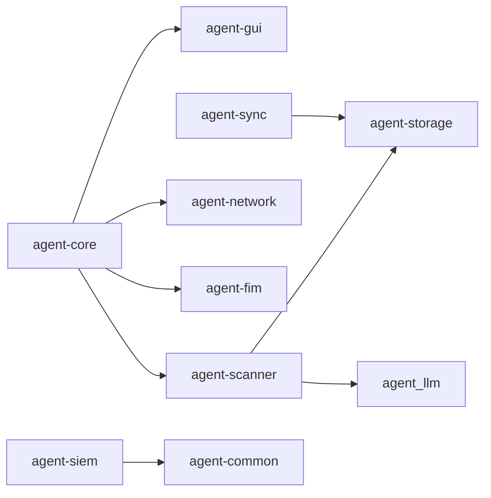
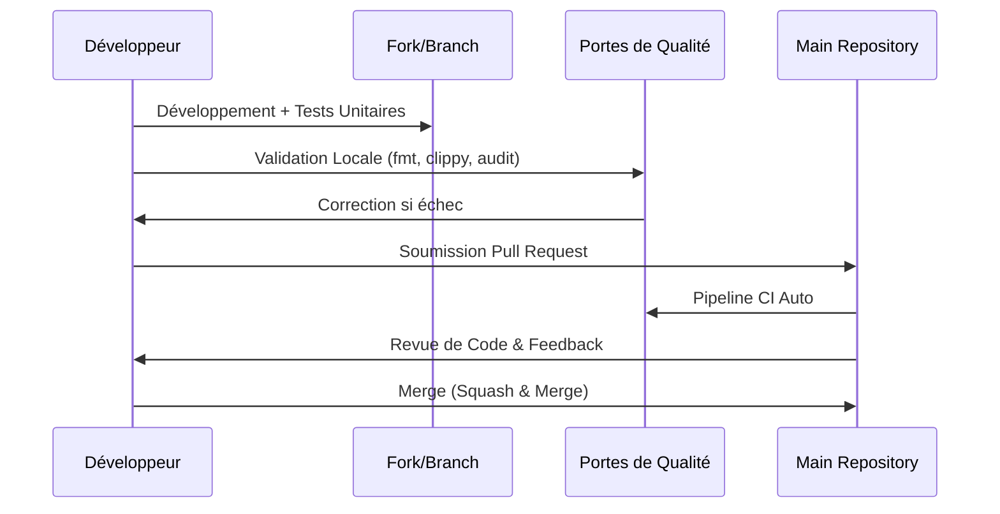

<h1 align="center">GUIDE DE CONTRIBUTION</h1>

<p align="center">
  <strong>Standard d'Excellence Technique - Sentinel GRC Agent</strong>
</p>

---

Merci de votre intérêt stratégique pour le **Sentinel GRC Agent**. Nous maintenons des standards de qualité extrêmement élevés pour garantir la souveraineté et la sécurité du projet. Ce guide détaille le protocole de contribution.

## 🛠️ Environnement de Développement

### Prérequis Systèmes
- **Rust Edition 2024** (v1.93.0+)
- **Composants** : `rustfmt`, `clippy`, `llvm-tools-preview`.
- **Audit Tools** : `cargo-deny`, `cargo-audit`.

### Initialisation Rapide
```bash
git clone https://github.com/CTC-Kernel/sentinel-agent.git
cd sentinel-agent
cargo build && cargo test
```

---

## 🔝 Portes de Qualité (CI/CD)

Toute Pull Request doit franchir les portes de qualité suivantes avant revue :

| Vérification | Commande de Validation | Impact |
| :--- | :--- | :--- |
| **Formatage** | `cargo fmt --check` | Bloquant |
| **Linter** | `cargo clippy --all-targets -- -D warnings` | Bloquant |
| **Tests** | `cargo test` | Bloquant |
| **Licences** | `cargo deny check` | Critique |
| **Sécurité** | `cargo audit` | Critique |

---

## 📜 Standards de Codage (Military Grade)

Nous appliquons des règles de programmation défensive strictes :

> [!WARNING]
> **Interdiction de `unwrap()`** sur les entrées utilisateur ou les données réseau. Utilisez une gestion d'erreur exhaustive via `anyhow` ou `thiserror`.

- **Typage Strict** : Aucun type `any` ou équivalent flou. Les structures de données doivent être explicites.
- **Arithmétique Sûre** : Utilisez systématiquement `saturating_*()` ou `.clamp()` pour éviter les overflows.
- **Sécurité UTF-8** : Manipulation des chaînes via `chars()` ou `char_indices()`. Jamais d'indexation par octets directe.
- **Injection SQL** : Paramétrisation obligatoire pour toutes les requêtes SQLite.

---

## 🏗️ Architecture Modulaire

Le workspace est divisé en crates spécialisées pour une isolation optimale des domaines :



---

## 🔄 Flux de Contribution (Git Flow)



---

## 🚨 Signalement & Communication

- **Bugs & Features** : Utilisez les [GitHub Issues](https://github.com/CTC-Kernel/sentinel-agent/issues).
- **Sécurité** : Consultez obligatoirement le [SECURITY.md](SECURITY.md) pour les divulgations sensibles.

---

<p align="center">
  <em>L'excellence technique est notre seule mesure.</em><br>
  © 2024-2026 Cyber Threat Consulting. Sous licence MIT.
</p>
