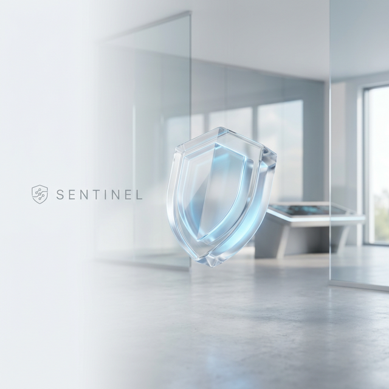
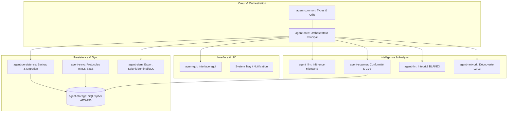

<p align="center">
  
</p>

<h1 align="center">SENTINEL GRC AGENT</h1>

<p align="center">
  <strong>Military-Grade Security & Compliance Orchestration</strong>
</p>

<p align="center">
  <a href="https://github.com/CTC-Kernel/sentinel-agent/actions/workflows/ci.yml"></a>
  <a href="LICENSE"></a>
  <a href="https://www.rust-lang.org/"></a>
  
</p>

---

Sentinel GRC Agent est un agent d'endpoint souverain et ultra-performant, conçu pour la surveillance rigoureuse de la conformité, le scan profond de vulnérabilités, l'analyse intelligente par IA et l'intégration SIEM. C'est le pilier technique de la plateforme GRC (Gouvernance, Risques, Conformité) pour les environnements à haute exigence de sécurité.

> [!IMPORTANT]
> **Développé par [Cyber Threat Consulting](https://cyber-threat-consulting.com)**
> Solutions de souveraineté numérique et de cyber-défense.

## 🛡️ Fonctionnalités Premium AAA

### 1. Gouvernance & Conformité (Compliance)
- **Frameworks Critiques** : 21 contrôles natifs alignés sur **CIS, NIS2, ISO 27001, DORA et SOC2**.
- **Scan de Vulnérabilités** : Analyse temps réel de plus de 151 paquets système contre les bases CVE.
- **Auto-Remédiation** : Correction intelligente des écarts de conformité sans intervention humaine.

### 2. Sécurité Offensive & Détection (Detection)
- **FIM (File Integrity Monitoring)** : Moteur de surveillance d'intégrité basé sur BLAKE3/SHA2 pour les fichiers système critiques.
- **Détection de Menaces** : Surveillance continue des processus et détection d'anomalies comportementales.
- **Analyse Réseau** : Cartographie OSI Couches 2/3, découverte passive (mDNS, SSDP, ARP) et détection de rogue devices.

### 3. Intelligence Artificielle Locale (Local AI)
- **Agent LLM** : Inférence locale via **MistralRS** (Mistral, Llama) pour l'analyse intelligente des logs et des événements de sécurité sans fuite de données vers le Cloud. (Accélération matérielle Apple Silicon/NVIDIA).

### 4. Intégration & Résilience (Ecosystem)
- **Moteur SIEM** : Connecteurs natifs pour **Splunk, Microsoft Sentinel, ELK et Syslog**.
- **Persistance & Recovery** : Gestion avancée du cycle de vie (backup chiffré, rotation de clés, migration de base de données).
- **Interface Next-Gen** : Dashboard interactif 14 modules sur **egui** avec mode sombre dynamique.

---

## 🏗️ Architecture du Système

L'agent est conçu comme un écosystème de crates Rust hautement spécialisées pour une isolation maximale et une performance optimale.



---

## 🚀 Mise en Œuvre Rapide

### Prérequis
- **Rust Edition 2024** (v1.93.0+)
- **OS Supportés** : Windows 10+ (x64), macOS 12+ (Universal), Linux (Ubuntu, RHEL, Debian).

### Compilation

```bash
# Compilation Full (GUI + All Features)
cargo build --release --package agent-core --features gui

# Compilation Serveur Headless
cargo build --release --package agent-core
```

---

## 🔒 Sécurité par Conception

- **Zero-Trust Communication** : mTLS 1.3 avec certificats forcés.
- **Chiffrement Militaire** : AES-256 GCM (SQLCipher) pour toutes les données persistantes.
- **Souveraineté IA** : Les modèles de langage s'exécutent LOCALEMENT, aucune donnée de sécurité ne quitte l'infrastructure.
- **Intégrité Logicielle** : Signature Authenticode/GPG et vérification de chaîne de confiance.

---

## 🤝 Contribution & Support

- **Assistance** : [GitHub Issues](https://github.com/CTC-Kernel/sentinel-agent/issues)
- **Consulting** : [cyber-threat-consulting.com](https://cyber-threat-consulting.com)

---

<p align="center">
  © 2024-2026 Cyber Threat Consulting. Sous licence MIT.
</p>
