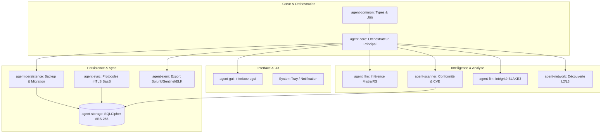

# Sentinel-GRC Agent for End point

**The Sovereign Standard for Modern Security & Compliance**

🏢 **[Cyber Threat Consulting](https://cyber-threat-consulting.com)** 
Expert en souveraineté numérique et cyber-défense

<p align="center">
  
</p>


[](https://github.com/CTC-Kernel/sentinel-agent/actions/workflows/ci.yml)
[](LICENSE)


---

Sentinel GRC Agent est un agent d'endpoint souverain et ultra-performant, conçu pour la surveillance rigoureuse de controls de conformités, le scan profond de vulnérabilités, l'analyse intelligente par IA et l'intégration SIEM. C'est le pilier technique de la plateforme GRC (Gouvernance, Risques, Conformité) pour les environnements à haute exigence de sécurité.

> [!IMPORTANT]
> **Développé par [Cyber Threat Consulting](https://cyber-threat-consulting.com)**
> 🌐 Solutions de souveraineté numérique et de cyber-défense
> 📧 [contact@cyber-threat-consulting.com](mailto:contact@cyber-threat-consulting.com)

## 🛡️ Fonctionnalités Premium AAA

### 1. Gouvernance & Conformité (Compliance)
- **Frameworks Critiques** : 21 contrôles natifs alignés sur **CIS, NIS2, ISO 27001, DORA et SOC2**.
- **Scan de Vulnérabilités** : Analyse temps réel de plus de 151 paquets système contre les bases CVE.
- **Auto-Remédiation** : Correction intelligente des écarts de conformité sans intervention humaine.

### 2. Sécurité Offensive & Détection (Detection)
- **FIM (File Integrity Monitoring)** : Moteur de surveillance d'intégrité basé sur BLAKE3/SHA2 pour les fichiers système critiques.
- **Détection de Menaces** : Surveillance continue des processus et détection d'anomalies comportementales.
- **Analyse Réseau** : Cartographie OSI Couches 2/3, découverte passive (mDNS, SSDP, ARP) et détection de rogue devices.

### 3. Intelligence Artificielle Locale (Local AI)
- **Agent LLM** : Inférence locale via **MistralRS** (Mistral, Llama) pour l'analyse intelligente des logs et des événements de sécurité sans fuite de données vers le Cloud. (Accélération matérielle Apple Silicon/NVIDIA).

### 4. Intégration & Résilience (Ecosystem)
- **Moteur SIEM** : Connecteurs natifs pour **Splunk, Microsoft Sentinel, ELK et Syslog**.
- **Persistance & Recovery** : Gestion avancée du cycle de vie (backup chiffré, rotation de clés, migration de base de données).
- **Interface Next-Gen** : Dashboard interactif 14 modules sur **egui** avec mode sombre dynamique.

---

## 🏗️ Architecture du Système

L'agent est conçu comme un écosystème de crates Rust hautement spécialisées pour une isolation maximale et une performance optimale.



---

## 🚀 Mise en Œuvre Rapide

### Prérequis
- **Rust Edition 2024** (v1.93.0+)
- **OS Supportés** : Windows 10+ (x64), macOS 12+ (Universal), Linux (Ubuntu, RHEL, Debian).
- **Dépendances Optionnelles** : OpenSSL, SQLite3, libgtk3 (pour GUI)

### Installation

#### Option 1: Binaires Pré-compilés
```bash
# Téléchargement depuis GitHub Releases
wget https://github.com/CTC-Kernel/sentinel-agent/releases/latest/download/sentinel-agent-linux-x64.tar.gz
tar -xzf sentinel-agent-linux-x64.tar.gz
sudo ./install.sh
```

#### Option 2: Compilation Source
```bash
# Clonage du repository
git clone https://github.com/CTC-Kernel/sentinel-agent.git
cd sentinel-agent

# Compilation Full (GUI + All Features)
cargo build --release --package agent-core --features gui

# Compilation Serveur Headless
cargo build --release --package agent-core

# Installation système
cargo install --path crates/agent-core
```

### Configuration Initiale

```bash
# Génération de la configuration par défaut
sentinel-agent --init-config

# Édition de la configuration
nano config/agent.json

# Démarrage du service
sudo systemctl start sentinel-agent
sudo systemctl enable sentinel-agent
```

---

## 📊 Tableau de Bord des Modules

| Module | Fonction | Statut | Dépendances |
|--------|----------|--------|-------------|
| **agent-core** | Orchestrateur principal | ✅ Stable | agent-common |
| **agent-gui** | Interface egui interactive | ✅ Stable | agent-core, egui |
| **agent-scanner** | Scan CVE & conformité | ✅ Stable | agent-common |
| **agent-network** | Découverte réseau L2/L3 | ✅ Stable | agent-common |
| **agent-storage** | Persistance SQLCipher | ✅ Stable | rusqlite, sqlcipher |
| **agent-sync** | Synchronisation mTLS | � Beta | agent-storage, tokio |
| **agent-siem** | Connecteurs SIEM | 🚧 Beta | agent-core, serde |

---

## 🎯 Cas d'Usage

### Entreprises & MSSP
- **Audit Continu** : Surveillance 24/7 de la conformité réglementaire
- **Gestion des Vulnérabilités** : Détection et priorisation automatique des CVE
- **Incident Response** : Analyse forensique et génération de preuves d'audit

### Secteurs Régulés
- **Finance** : Conformité DORA, ACPR, et régulations bancaires
- **Santé** : Secrétariat médical et conformité HIPAA
- **Énergie** : Sécurité des infrastructures critiques (NIS2)
- **Administration** : Protection des données sensibles et souveraineté

---

## ⚙️ Configuration Avancée

### Fichiers de Configuration
```json
{
  "agent": {
    "id": "sentinel-agent-001",
    "organization": "acme-corp",
    "mode": "production"
  },
  "security": {
    "encryption_key_rotation": "monthly",
    "certificate_path": "/etc/sentinel/certs",
    "fim_enabled": true
  },
  "compliance": {
    "frameworks": ["CIS", "ISO27001", "NIS2"],
    "scan_interval": "hourly",
    "auto_remediation": true
  },
  "ai": {
    "model_path": "/models/mistral-7b-instruct.gguf",
    "device": "auto",  # cpu/cuda/metal
    "max_tokens": 4096
  }
}
```

### Variables d'Environnement
```bash
export SENTINEL_CONFIG_PATH="/etc/sentinel/agent.json"
export SENTINEL_LOG_LEVEL="info"
export SENTINEL_DB_PATH="/var/lib/sentinel/agent.db"
export SENTINEL_SIEM_ENDPOINT="https://splunk.company.com:8088"
```

---

## 🔍 Monitoring & Débogage

### Journaux et Logs
```bash
# Logs en temps réel
sudo journalctl -u sentinel-agent -f

# Logs détaillés
sentinel-agent --log-level debug

# Export des logs pour analyse
sentinel-agent --export-logs /tmp/sentinel-logs.tar.gz
```

### Métriques de Performance
```bash
# État du service
sentinel-agent --status

# Statistiques détaillées
sentinel-agent --stats

# Test de connectivité
sentinel-agent --test-connectivity
```

---

## � Sécurité par Conception

- **Zero-Trust Communication** : mTLS 1.3 avec certificats forcés.
- **Chiffrement Militaire** : AES-256 GCM (SQLCipher) pour toutes les données persistantes.
- **Souveraineté IA** : Les modèles de langage s'exécutent LOCALEMENT, aucune donnée de sécurité ne quitte l'infrastructure.
- **Intégrité Logicielle** : Signature Authenticode/GPG et vérification de chaîne de confiance.

---

## 🤝 Contribution & Support

### Guide de Contribution

1. **Fork** le repository
2. **Créer** une branche feature (`git checkout -b feature/amazing-feature`)
3. **Commit** vos changements (`git commit -m 'Add amazing feature'`)
4. **Push** vers la branche (`git push origin feature/amazing-feature`)
5. **Ouvrir** une Pull Request

### Standards de Qualité
- **Code Style** : `cargo fmt` et `cargo clippy` obligatoires
- **Tests** : Couverture minimale de 80%
- **Documentation** : Comments `///` pour toutes les APIs publiques
- **Sécurité** : Validation `cargo-deny` avant merge

### Canal de Support

- **🐛 Rapports de Bugs** : [GitHub Issues](https://github.com/CTC-Kernel/sentinel-agent/issues)
- **💡 Suggestions** : [GitHub Discussions](https://github.com/CTC-Kernel/sentinel-agent/discussions)
- **📧 Consulting** : [contact@cyber-threat-consulting.com](mailto:contact@cyber-threat-consulting.com) | [cyber-threat-consulting.com](https://cyber-threat-consulting.com)
- **🏢 Website** : [cyber-threat-consulting.com](https://cyber-threat-consulting.com)
- **📚 Documentation** : [Wiki du Projet](https://github.com/CTC-Kernel/sentinel-agent/wiki)

### Licence

Ce projet est sous **Licence MIT** - voir le fichier [LICENSE](LICENSE) pour les détails.

---

## 🙏 Remerciements

- **Rust Community** : Écosystème exceptionnel pour la sécurité système
- **MistralRS** : Inférence locale performante pour l'IA souveraine
- **egui** : Framework GUI immédiat et multi-plateforme
- **SQLCipher** : Chiffrement robuste pour la persistance des données

---

<p align="center">
  <strong>🛡️ Sentinel GRC Agent - La Sécurité Souveraine pour l'Ère Numérique</strong>
  <br>
  <em>Built with ❤️ and Rust by <a href="https://cyber-threat-consulting.com">Cyber Threat Consulting</a></em>
  <br>
  <a href="https://cyber-threat-consulting.com">🌐 Visitez notre site</a>
</p>
