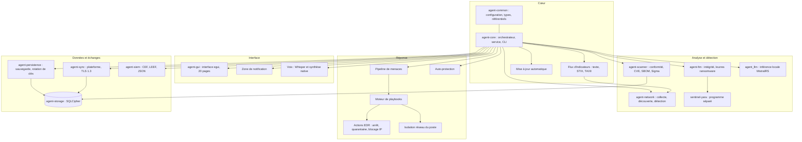

# Sentinel GRC Nexus · Agent Endpoint

**The Sovereign Standard for Modern Security & Compliance**

🏢 **[Cyber Threat Consulting](https://cyber-threat-consulting.com)**
Expert en souveraineté numérique et cyber-défense

<p align="center">
  
</p>


[](https://github.com/CTC-Kernel/sentinel-agent/actions/workflows/ci.yml)
[](LICENSE)


---

L'agent Sentinel GRC Nexus protège et contrôle un poste ou un serveur : conformité aux référentiels, analyse de vulnérabilités priorisée par l'exploitation réelle, détection et réponse (EDR), intégrité des fichiers, surveillance réseau et assistant IA exécuté localement. Il fonctionne relié à la plateforme Sentinel GRC ou seul, en mode autonome. Le binaire et les paquets s'appellent `sentinel-agent`.

> [!IMPORTANT]
> **Développé par [Cyber Threat Consulting](https://cyber-threat-consulting.com)**
> 🌐 Solutions de souveraineté numérique et de cyber-défense
> 📧 [contact@cyber-threat-consulting.com](mailto:contact@cyber-threat-consulting.com)

## 🛡️ Fonctionnalités

### 1. Conformité
- **34 contrôles intégrés** : chiffrement du disque, pare-feu, antivirus, MFA, politique de mots de passe, mises à jour, verrouillage de session, durcissement Windows et Linux, Secure Boot, SSH, DNS, conteneurs, certificats, stratégies d'annuaire (GPO, LDAP, groupes privilégiés).
- **9 référentiels notés par exigence** : CIS Controls v8, NIST CSF 2.0, ISO/IEC 27001:2022, PCI DSS v4.0, guide d'hygiène ANSSI, NIS 2, DORA, SOC 2 et HDS. Chaque catalogue indique ce que l'agent ne peut pas mesurer ; les correspondances sont à faire valider par un auditeur.
- **Contrôles personnalisés** : déclarés en TOML dans le dossier `checks.d`, sans recompiler ([exemple](config/checks.example.toml)).
- **Remédiation** : aperçu puis application d'un correctif depuis l'interface, pour les contrôles qui en proposent un.
- **Rapports** : synthèse exécutive, audit de conformité et incidents, exportés en HTML ou en PDF avec empreinte SHA-256 du contenu.

### 2. Vulnérabilités et inventaire
- **Sources analysées** : paquets APT et RPM (RHEL, AlmaLinux, Rocky Linux, openSUSE), Homebrew et applications macOS, logiciels Windows, paquets pip, npm et cargo installés globalement. Recherche des CVE via [OSV](https://osv.dev).
- **Priorisation par exploitation réelle** : chaque CVE est croisée avec le catalogue **CISA KEV** (failles déjà exploitées) et le score **EPSS** (probabilité d'exploitation). Ces deux flux sont téléchargés en entier et gardés en cache ; la priorité de correction apparaît dans le tableau, le détail, l'export CSV et le contexte de l'assistant.
- **SBOM** : export CycloneDX 1.5 des logiciels installés.
- **Extensions de navigateur** : inventaire avec lecture du risque.

### 3. Détection
- **Intégrité des fichiers (FIM)** : empreintes BLAKE3/SHA-2, chemins surveillés et motifs ignorés configurables.
- **Processus** : motifs intégrés et **règles Sigma** `process_creation` déposées dans `sigma.d` ([exemple](config/sigma.example.yml)). Une règle utilisant une construction non prise en charge est refusée, jamais réinterprétée.
- **Réseau** : collecte des interfaces, connexions, routes et DNS ; découverte par ARP et balayage ping ; détection de beaconing, C2, DGA, exfiltration, minage et balayage de ports.
- **USB** : surveillance des périphériques, blocage optionnel du stockage de masse.
- **Flux d'indicateurs** : listes texte, bundles STIX 2.1 et collections TAXII 2.1, ajoutés aux indicateurs poussés par la plateforme. Aucun flux n'est contacté par défaut.

À activer explicitement :

| Fonction | Activation | État |
|----------|------------|------|
| Fichiers leurres anti-ransomware | `ransomware_canaries` ou réglage dans Paramètres | Désactivé par défaut |
| Processus évalués dès leur lancement | `process_event_telemetry` | Désactivé par défaut ; demande les droits administrateur. Sous Linux, option de compilation `proc-connector` |
| Analyse YARA des fichiers signalés par le FIM | Règles dans `yara.d` + programme `sentinel-yara` | À construire depuis [tools/sentinel-yara](tools/sentinel-yara) ; pas encore inclus dans les installeurs |

### 4. Réponse
- **Actions EDR** : arrêt d'un processus, mise en quarantaine et restauration d'un fichier, blocage et déblocage d'une adresse IP.
- **Isolation réseau du poste** : pf (macOS), iptables (Linux), pare-feu Windows. La plateforme, le DNS et le DHCP restent joignables ; levée manuelle ou à l'expiration de la durée demandée.
- **Playbooks** : conditions, actions automatiques et pipeline détection → classification → réponse.
- **Auto-protection** : intégrité du binaire et de la configuration, détection de débogueur, surveillance de l'enregistrement du service.

### 5. Assistant IA local
- **Inférence sur le poste** via **MistralRS**, modèles GGUF (Llama 3.1 8B, Qwen2.5-Coder 7B, DeepSeek-R1 Distill, Gemma 2 2B). GPU Metal sur Apple Silicon ; sur x86_64, AVX2/FMA choisis à l'exécution. Aucun événement de sécurité n'est envoyé à un service d'IA.
- **Actions proposées, jamais exécutées seules** : relancer l'analyse, exporter le SBOM, corriger un contrôle, isoler le poste… Un bouton apparaît sous la réponse ; rien ne part avant confirmation de l'opérateur.
- **Recherche dans l'historique** : « que s'est-il passé mardi ? » ajoute au contexte les événements enregistrés sur la période.
- **Voix** : dictée par Whisper exécuté sur le poste et synthèse vocale native.

### 6. Interface
- **20 pages** sur **egui** : tableau de bord, surveillance, conformité, logiciels, vulnérabilités, intégrité, menaces, journal d'audit, réseau, découverte, cartographie, actifs, risques, rapports, assistant, terminal, synchronisation, notifications, réglages, à propos.
- Thèmes clair, sombre et système, palette de commandes, typographie Inter / JetBrains Mono, contraste WCAG vérifié par tests.

### 7. Plateforme et écosystème
- **Enrôlement** par jeton émis depuis la console, **heartbeat**, commandes serveur et fonctionnement hors ligne (7 jours par défaut).
- **Actifs et CMDB** : inventaire du poste et des équipements découverts, synchronisé vers la plateforme.
- **SIEM** : formats CEF, LEEF et JSON ; transport Syslog (UDP, TCP, TLS) ou HTTP (Splunk HEC, Microsoft Sentinel, Elastic).
- **Mise à jour automatique** : paquet vérifié par SHA-256 et, si une clé publique est embarquée à la compilation, par signature ed25519 ([détail](docs/UPDATE_SIGNING.md)).

---

## 🏗️ Architecture du Système

Un workspace Rust de onze crates, plus un programme YARA séparé.


```mermaid
graph TD
    subgraph "Interface"
        GUI["agent-gui : interface egui, 20 pages"]
        Tray["Zone de notification"]
        Voice["Voix : Whisper et synthèse native"]
    end

    subgraph "Analyse et détection"
        Scanner["agent-scanner : conformité, CVE, SBOM, Sigma"]
        FIM["agent-fim : intégrité, leurres ransomware"]
        Net["agent-network : collecte, découverte, détection"]
        LLM["agent_llm : inférence locale MistralRS"]
        Yara["sentinel-yara : programme séparé"]
    end

    subgraph "Réponse"
        Threat["Pipeline de menaces"]
        Playbook["Moteur de playbooks"]
        EDR["Actions EDR : arrêt, quarantaine, blocage IP"]
        Iso["Isolation réseau du poste"]
        SelfProt["Auto-protection"]
    end

    subgraph "Cœur"
        Core["agent-core : orchestrateur, service, CLI"]
        Common["agent-common : configuration, types, référentiels"]
        Intel["Flux d'indicateurs : texte, STIX, TAXII"]
        Update["Mise à jour automatique"]
    end

    subgraph "Données et échanges"
        Storage[("agent-storage : SQLCipher")]
        Persist["agent-persistence : sauvegarde, rotation de clés"]
        Sync["agent-sync : plateforme, TLS 1.3"]
        SIEM["agent-siem : CEF, LEEF, JSON"]
    end

    Core --> GUI
    Core --> Tray
    Core --> Voice
    Core --> Scanner
    Core --> FIM
    Core --> Net
    Core --> LLM
    Core --> Threat
    Core --> SelfProt
    Core --> Intel
    Core --> Update
    Core --> Sync
    Core --> SIEM
    Core --> Persist

    FIM --> Yara
    Intel --> Net
    Threat --> Playbook
    Playbook --> EDR
    Playbook --> Iso
    Persist --> Storage
    Sync --> Storage
    Scanner --> Storage
    Common --- Core
```

`apps/nexus-web` contient par ailleurs la console web React de pilotage, documentée dans son [README](apps/nexus-web/README.md).

---

## 🚀 Installation

### Systèmes pris en charge
- **Windows** 10 et suivants (x64)
- **macOS** 11 et suivants (binaire universel Apple Silicon / Intel)
- **Linux** : Debian, Ubuntu (`.deb`), RHEL, Fedora et dérivés (`.rpm`), x86_64

### Paquets

Chaque version publiée sur [GitHub Releases](https://github.com/CTC-Kernel/sentinel-agent/releases/latest) fournit quatre installeurs et leurs sommes SHA-256.

| Système | Fichier | Installation |
|---------|---------|--------------|
| macOS | `SentinelAgent-<version>.pkg` (signé et notarisé) | Ouvrir le paquet, ou `sudo installer -pkg SentinelAgent-<version>.pkg -target /` |
| Windows | `SentinelAgentSetup-<version>.msi` | Lancer l'installeur en administrateur |
| Debian / Ubuntu | `sentinel-agent_<version>-1_amd64.deb` | `sudo dpkg -i sentinel-agent_<version>-1_amd64.deb` |
| RHEL / Fedora | `sentinel-agent-<version>-1.x86_64.rpm` | `sudo rpm -i sentinel-agent-<version>-1.x86_64.rpm` |

Les paquets Linux installent le binaire `/usr/bin/sentinel-agent`, le service systemd, un profil AppArmor et la rotation des journaux.

### Deux modes, choisis à l'installation

| Mode | Pour qui | Ce qui change |
|------|----------|---------------|
| **Plateforme** | Organisations, MSSP | L'agent s'enrôle avec un jeton et synchronise conformité, inventaire et alertes avec la console Sentinel GRC. |
| **Autonome (standalone)** | Particuliers, postes isolés, protection EDR seule | Gratuit. EDR, intégrité des fichiers, conformité et analyse de vulnérabilités tournent en local. Ni enrôlement, ni heartbeat, ni envoi, ni commande distante : rien n'est transmis à une plateforme. Connexion à une plateforme possible plus tard depuis les réglages. |

> [!NOTE]
> Dans les deux modes, l'analyse de vulnérabilités interroge des bases publiques : les noms et versions des paquets installés sont envoyés à OSV pour y chercher les CVE, et les catalogues CISA KEV et EPSS sont téléchargés.

```bash
# Windows (silencieux)
msiexec /i SentinelAgentSetup-<version>.msi /qn INSTALLMODE=STANDALONE     # autonome
msiexec /i SentinelAgentSetup-<version>.msi /qn ENROLLMENTTOKEN=<jeton>    # plateforme
msiexec /i SentinelAgentSetup-<version>.msi /qn SERVERURL=https://grc.exemple.com/fn/agentApi ENROLLMENTTOKEN=<jeton>   # plateforme auto-hébergée

# Debian / Ubuntu
SENTINEL_STANDALONE=1 sudo -E dpkg -i sentinel-agent_*.deb

# macOS : pkg construit avec SENTINEL_STANDALONE=1, ou choix dans l'assistant au premier lancement

# Basculer après coup (droits administrateur)
sentinel-agent standalone            # protection locale seule
sentinel-agent standalone --disable  # puis `sentinel-agent enroll` pour rejoindre une plateforme
```

### Ligne de commande

| Commande | Rôle |
|----------|------|
| `sentinel-agent enroll [--server <url>]` | Enrôle l'agent. Le jeton est demandé à l'invite ou lu dans `SENTINEL_ENROLLMENT_TOKEN` ; `--token` l'expose dans la liste des processus. |
| `sentinel-agent standalone [--disable]` | Active ou quitte le mode autonome. |
| `sentinel-agent install` / `uninstall [--purge] [--keep-logs]` | Installe ou retire le service système ; `--purge` supprime aussi configuration, journaux et base. |
| `sentinel-agent start` / `stop` / `status` | Pilote le service. |
| `sentinel-agent run [--no-tray]` | Lance l'agent au premier plan ; `--no-tray` pour un serveur sans session graphique. |

Options générales, à placer avant la commande : `--config <fichier>` et `--log-level <trace|debug|info|warn|error>`.

---

## ⚙️ Configuration

L'agent lit, dans l'ordre : ses valeurs par défaut, le fichier `agent.json`, puis les variables d'environnement `SENTINEL_*`.

```json
{
  "standalone": false,
  "server_url": "https://grc.exemple.com/fn/agentApi",
  "check_interval_secs": 3600,
  "heartbeat_interval_secs": 60,
  "offline_mode_days": 7,
  "log_level": "info",
  "tls_verify": true,
  "usb_monitoring": true,
  "usb_block_mass_storage": true
}
```

| Système | Configuration | Base de données | Journaux |
|---------|---------------|-----------------|----------|
| Windows | `C:\ProgramData\Sentinel\agent.json` | `C:\ProgramData\Sentinel\data\agent.db` | `C:\ProgramData\Sentinel\logs\` |
| Linux | `/etc/sentinel/agent.json` | `/var/lib/sentinel-grc/agent.db` | `/var/log/sentinel-grc/` |
| macOS | `~/Library/Application Support/SentinelGRC/agent.json` | `~/Library/Application Support/SentinelGRC/agent.db` | `~/Library/Application Support/SentinelGRC/logs/` |

Variables d'environnement les plus utiles :

```bash
export SENTINEL_SERVER_URL="https://grc.exemple.com/fn/agentApi"
export SENTINEL_LOG_LEVEL="debug"
export SENTINEL_ACTIVE_FRAMEWORKS="ISO27001,NIST-CSF"
export SENTINEL_CA_CERT_PATH="/etc/sentinel/ca.pem"
export SENTINEL_DATA_DIR="/opt/sentinel-data"
```

Les règles et contrôles ajoutés par l'exploitant se déposent dans le dossier de données : `checks.d` (contrôles TOML), `sigma.d` (règles Sigma), `yara.d` (règles YARA).

Référence complète — proxy, chemins FIM, flux d'indicateurs, plateforme auto-hébergée : [config/README.md](config/README.md) et [agent.full.example.json](config/agent.full.example.json).

---

## 🔍 Exploitation

```bash
# État du service
sentinel-agent status

# Journaux du service (Linux)
sudo journalctl -u sentinel-agent -f

# Lancer au premier plan avec des journaux détaillés
sentinel-agent --log-level debug run --no-tray
```

La page **Terminal** de l'interface affiche les journaux en direct, et **Journal d'audit** exporte la piste d'audit en CSV.

---

## 🧱 Compiler depuis les sources

**Prérequis** : Rust 1.85 ou plus récent (édition 2024). OpenSSL et SQLCipher sont compilés avec le projet.

```bash
# Linux : bibliothèques système
sudo apt-get install -y libssl-dev pkg-config libgtk-3-dev libayatana-appindicator3-dev \
  libxdo-dev libxcb-render0-dev libxcb-shape0-dev libxcb-xfixes0-dev libxkbcommon-dev \
  libudev-dev libasound2-dev libspeechd-dev
```

Sous macOS, la fonction `gui` embarque l'IA locale, dont la compilation demande Xcode complet (compilateur de shaders Metal). Sans lui, `MISTRALRS_METAL_PRECOMPILE=0` permet de vérifier, tester et analyser le code, mais le binaire obtenu ne fait pas d'inférence sur le GPU.

```bash
git clone https://github.com/CTC-Kernel/sentinel-agent.git
cd sentinel-agent

# Agent complet : interface, IA locale, voix, zone de notification
cargo build --release --package agent-core --features gui

# Variante des paquets Linux et Windows (sans voix)
cargo build --release --package agent-core --features gui --no-default-features

# Sans interface graphique ni assistant
cargo build --release --package agent-core

# Programme YARA (hors workspace)
cargo build --release --manifest-path tools/sentinel-yara/Cargo.toml
```

Le binaire produit est `target/release/agent-core` ; les paquets l'installent sous le nom `sentinel-agent`.

| Commande | Rôle |
|----------|------|
| `cargo xtask ci` | Formatage, clippy, tests et audit, comme la CI |
| `cargo xtask dist --target <linux\|macos\|windows\|all>` | Construit les paquets de distribution |
| `cargo xtask version` | Affiche la version du workspace |
| `cargo xtask keygen` / `cargo xtask sign <fichier>` | Clés et signature ed25519 des mises à jour |

---

## 📖 Crates et documentation

| Crate | Rôle |
|-------|------|
| [agent-core](crates/agent-core/README.md) | Orchestrateur, service système, ligne de commande, EDR, isolation, playbooks, mise à jour |
| [agent-common](crates/agent-common/README.md) | Configuration, types, erreurs, catalogues des référentiels |
| [agent-scanner](crates/agent-scanner/README.md) | Contrôles de conformité, vulnérabilités, SBOM, Sigma, processus, USB |
| [agent-fim](crates/agent-fim/README.md) | Intégrité des fichiers, leurres anti-ransomware |
| [agent-network](crates/agent-network/README.md) | Collecte, découverte et détection réseau |
| [agent-storage](crates/agent-storage/README.md) | Base SQLCipher, dépôts, migrations, rétention |
| [agent-persistence](crates/agent-persistence/README.md) | Sauvegarde, restauration, rotation de clés, migration |
| [agent-sync](crates/agent-sync/README.md) | Enrôlement, échanges avec la plateforme, mode hors ligne |
| [agent-siem](crates/agent-siem/README.md) | Export CEF, LEEF, JSON par Syslog ou HTTP |
| [agent-gui](crates/agent-gui/README.md) | Interface egui, export PDF, assistant |
| [agent_llm](crates/agent_llm/README.md) | Inférence locale, catalogue de modèles, prompts |

Documentation complémentaire :
- [Guide utilisateur](docs/USER_GUIDE.md) : installation, enrôlement et utilisation quotidienne
- [Configuration](config/README.md) : référence des options et des variables d'environnement
- [Signature des mises à jour](docs/UPDATE_SIGNING.md) : modèle de confiance et mise en place
- [Journal des modifications](CHANGELOG.md)
- [Contribution](CONTRIBUTING.md) et [Sécurité](SECURITY.md)

---

## 🎯 Cas d'Usage

### Entreprises & MSSP
- **Audit continu** : suivi permanent de la conformité réglementaire
- **Gestion des vulnérabilités** : détection et priorisation des CVE par exploitation réelle
- **Réponse à incident** : chronologie forensique, isolation du poste et preuves d'audit

### Secteurs Régulés
- **Finance** : DORA, PCI DSS
- **Santé** : HDS
- **Énergie et opérateurs essentiels** : NIS 2
- **Administration** : guide d'hygiène ANSSI, protection des données sensibles et souveraineté

### Particuliers et postes isolés
- **Mode autonome** : protection EDR locale, gratuite, sans plateforme

---

## 🔐 Sécurité par Conception

- **Échanges avec la plateforme** : TLS 1.3 au minimum, requêtes signées (HMAC-SHA256, horodatage et nonce), épinglage de certificat possible.
- **Données au repos** : base SQLCipher (AES-256). La clé est protégée par DPAPI sous Windows et par un fichier à droits restreints sous Unix.
- **IA souveraine** : les modèles s'exécutent localement.
- **Chaîne de livraison** : paquet macOS signé et notarisé, MSI signé, sommes SHA-256, SBOM CycloneDX et attestation de provenance à chaque version ; signature ed25519 des mises à jour lorsque la clé de signature est configurée.
- **Durcissement** : profil AppArmor, RELRO complet et pile non exécutable sous Linux ; ASLR et DEP sous Windows.

Signaler une vulnérabilité : voir [SECURITY.md](SECURITY.md).

---

## 🤝 Contribution & Support

### Guide de Contribution

1. **Fork** le repository
2. **Créer** une branche (`git checkout -b feature/ma-fonction`)
3. **Commit** vos changements
4. **Push** vers la branche (`git push origin feature/ma-fonction`)
5. **Ouvrir** une Pull Request

### Standards de Qualité
- **Style** : `cargo fmt` et `cargo clippy -- -D warnings` obligatoires
- **Tests** : `cargo test` ; la CI refuse toute baisse de couverture sous son plancher (34 % aujourd'hui, relevé à mesure que les tests s'ajoutent)
- **Dépendances** : `cargo deny check` et `cargo audit`
- **Secrets** : analyse Gitleaks de l'historique en CI

Détail dans [CONTRIBUTING.md](CONTRIBUTING.md).

### Canal de Support

- **🐛 Rapports de Bugs** : [GitHub Issues](https://github.com/CTC-Kernel/sentinel-agent/issues)
- **💡 Suggestions** : [GitHub Discussions](https://github.com/CTC-Kernel/sentinel-agent/discussions)
- **📧 Consulting** : [contact@cyber-threat-consulting.com](mailto:contact@cyber-threat-consulting.com) | [cyber-threat-consulting.com](https://cyber-threat-consulting.com)
- **📚 Documentation** : [Wiki du Projet](https://github.com/CTC-Kernel/sentinel-agent/wiki)

### Licence

Ce projet est sous **Licence MIT** - voir le fichier [LICENSE](LICENSE) pour les détails.

---

## 🙏 Remerciements

- **Rust Community** : écosystème exceptionnel pour la sécurité système
- **MistralRS** et **Candle** : inférence locale performante pour l'IA souveraine
- **egui** : framework GUI immédiat et multi-plateforme
- **SQLCipher** : chiffrement robuste pour la persistance des données
- **OSV, CISA KEV, EPSS, SigmaHQ, YARA-X** : bases et formats ouverts sur lesquels s'appuie la détection

---

<p align="center">
  <strong>🛡️ Sentinel GRC Nexus - La Sécurité Souveraine pour l'Ère Numérique</strong>
  <br>
  <em>Built with ❤️ and Rust by <a href="https://cyber-threat-consulting.com">Cyber Threat Consulting</a></em>
  <br>
  <a href="https://cyber-threat-consulting.com">🌐 Visitez notre site</a>
</p>
