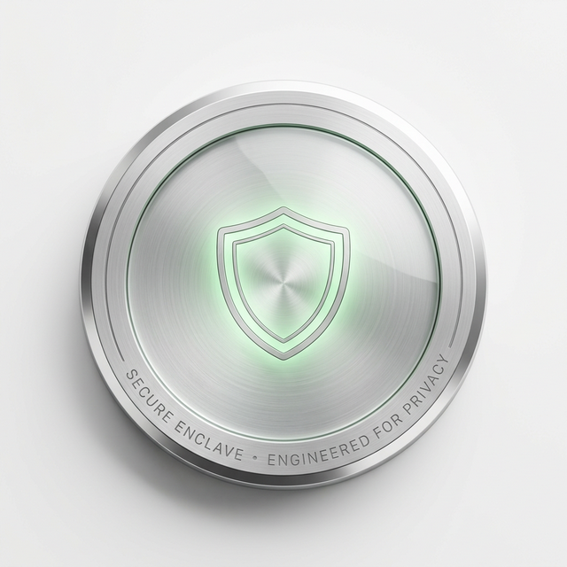

<p align="center">
  
</p>

# Security Policy
**Commitment to Privacy & System Integrity**

---

## 🛡️ Engagement de Sécurité

La sécurité n'est pas une option, c'est notre fondation. Sentinel GRC Agent est conçu pour résister aux vecteurs de menace les plus avancés tout en assurant une conformité rigoureuse.

### Versions Supportées

| Version | État du Support | Niveau de Critique |
| :--- | :--- | :--- |
| **2.0.x** | ✅ Actif (LTS) | Production Ready |
| < 2.0.0 | ❌ Obsolète | Non supporté |

---

## 🚨 Signaler une Vulnérabilité

Nous valorisons le travail des chercheurs en sécurité. Si vous découvrez une faille, suivez ce protocole strict pour une divulgation responsable.

> [!IMPORTANT]
> **NE CRÉEZ PAS de ticket GitHub public pour une faille de sécurité.**

### Protocole de Rapport
1. **Email** : Envoyez les détails à [***REMOVED***](mailto:***REMOVED***).
2. **Contenu** : Description détaillée, vecteurs d'attaque et étapes de reproduction (PoC).
3. **Confidentialité** : Accordez-nous un délai de **90 jours** pour la remédiation avant toute divulgation publique.

---

## 🔍 Analyse & Audit Continu

### Vérifications Automatisées de Haute Précision

Le pipeline de CI intègre des outils d'audit de grade industriel :

#### 🦀 Cargo Audit
Surveillance en temps réel des dépendances contre la base de données **RustSec**.
```bash
cargo audit # Exécuté localement et en CI
```

#### 🛡️ Cargo Deny
Garde-fou multicouche pour :
- **Security Advisories** : Blocage immédiat des vulnérabilités connues.
- **License Compliance** : Seules les licences approuvées (MIT, Apache 2.0, etc.) sont autorisées.
- **Bans & Sources** : Interdiction stricte de crates non auditées ou de sources non officielles.

---

## 🛠️ Architecture de Défense de Nouvelle Génération

### Souveraineté de l'IA (agent_llm)
Contrairement aux solutions classiques, notre moteur d'intelligence artificielle s'exécute **intégralement en local**.
- **Zéro Fuite de Données** : Les logs, configurations et événements système ne sont jamais transmis à des API tiers (OpenAI, Anthropic, etc.).
- **Inférence Privée** : Utilisation de modèles de langage open-source audités (Mistral, Llama).

### Intégrité Système (agent-fim)
Le moteur de File Integrity Monitoring utilise des primitives cryptographiques fortes (**BLAKE3**, **SHA2**) pour garantir l'absence d'altération du noyau et des fichiers critiques.

### Protection Anti-Tamper (Self-Protection)
Le module `self_protection.rs` surveille en permanence :
- **Intégrité binaire** : Vérification SHA-256 du binaire agent au démarrage.
- **Intégrité config** : Détection de modification non autorisée du fichier de configuration.
- **Détection debugger** : Alerte si un debugger est attaché au processus agent.
- **Monitoring services** : Surveillance des changements d'état du service système.

### Credentials & Enrollment
- Les credentials agent sont stockés dans une sous-collection Firestore `credentials/main` (jamais dans le document principal).
- Le token d'enrollment est un JWT signé contenant l'`organizationId` du tenant.
- `SecureConfig` est un wrapper RAII qui zéroïse automatiquement les secrets en mémoire à la destruction (`ZeroizeOnDrop`).
- `panic = "unwind"` (pas "abort") est requis dans Cargo.toml pour garantir l'exécution du Drop trait.

### Sécurité du Code & Données
- **SQLCipher (AES-256 GCM)** : Base de données locale entièrement chiffrée. Clé dérivée au premier enrollment.
- **mTLS 1.3** : Authentification mutuelle pour la synchronisation (note : no-op sur Firebase, documenté dans `client.rs` et `api.js`).
- **Zero Unsafe** : Usage proscrit du mot-clé `unsafe` dans les modules critiques.
- **EDR Anti-Draper** : L'agent ne peut pas exécuter d'action EDR contre lui-même (protection anti-suicide).

---

## 📜 Licences Approuvées

Nous n'acceptons que les licences permissives garantissant la pérennité du projet :

| Type | Licences |
| :--- | :--- |
| **Permissives** | MIT, Apache-2.0, BSD-2-Clause, BSD-3-Clause, ISC |
| **Spécialisées** | MPL-2.0, Zlib, OpenSSL, Unicode-DFS-2016 |

---

## 📈 Réponse aux Incidents

En cas de vulnérabilité confirmée, notre équipe suit le workflow **S.A.M.V.P** :
1. **S**élection & Triage (CVSS Scoring).
2. **A**tténuation (Workaround immédiat).
3. **M**ise à jour (Correctif de code).
4. **V**érification (Audit post-patch).
5. **P**ublication (Avis de sécurité officiel).

---

<p align="center">
  <em>Protégez ce qui compte.</em><br>
  <strong>Cyber Threat Consulting Safety Team</strong>
</p>
