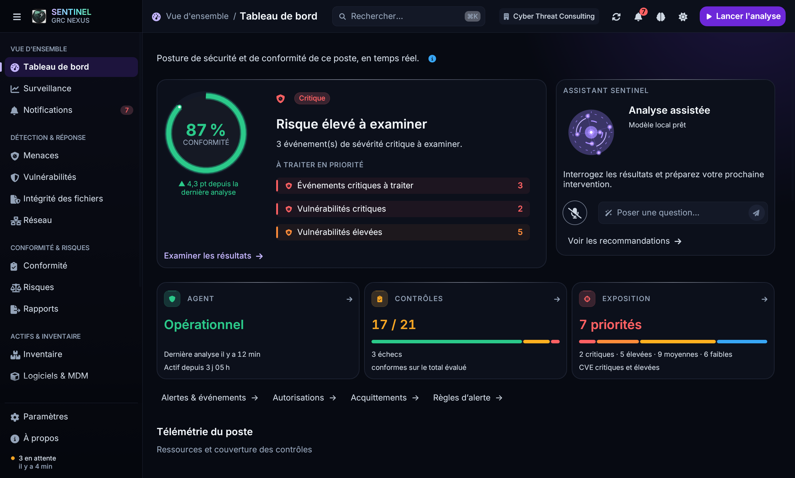

# Finition GUI desktop — 4 octobre 2026

**Suite : [harmonie des couleurs et du mouvement](harmony/README.md)** — dernière version de la palette et des effets.

Refonte du dashboard et des composants partagés de `agent-gui` (egui). Le diagnostic et les priorités apparaissent désormais avant le contexte de connexion. La direction conserve l'identité graphite/violet et réduit le décor pour donner plus de poids aux données.

## Changements

- Dashboard : diagnostic en premier, composition asymétrique sur grand écran, indicateurs de sécurité avant les ressources, connexion/export en bas de page. À petite largeur, assistant repliable après les indicateurs.
- Assistant : radar compact, statut réel du modèle ou de l'activité, accès explicite aux recommandations. Le radar violet représente l'assistant et ne répète plus le code couleur du risque. Pas d'amplitude vocale simulée sur le dashboard.
- Surfaces : suppression de la grille générale et du halo cyan inférieur ; un halo violet discret en haut. Ombres des cartes et boutons atténuées, surfaces claires plus neutres.
- Lecture : texte courant à 14 points, lignes compactes de tableau à 28 points, zébrures et remplissages de sparklines allégés. Icône de menace harmonisée entre verdict et navigation.
- Interaction : survol commun à 150 ms, onglet à 150 ms, panneaux à 220 ms, page à 160 ms avec contenu lisible dès son entrée. Focus ajouté aux lignes de tableau et au panneau de diagnostic.
- Radar : phase accumulée seulement pendant traitement, écoute ou réponse vocale ; aucune demande de rafraîchissement décoratif au repos. Mouvement réduit respecté. Les ripples restent dans l'espace réservé.
- États vides : médaillon neutre ; diagnostic en attente sans promesse de sécurité sur l'absence de résultats.
- Petites largeurs : filtres Terminal séparés en deux lignes, légende Cartographie adaptable avec symboles solidaires des libellés, recommandations et en-tête d'activité adaptables. Les libellés de priorité longs sont tronqués avec leur texte complet en infobulle.

## Vérifications

- `cargo test --offline -p agent-gui --lib` : **165 tests réussis**, dont contrastes du thème, interactions existantes et tests du rythme de rafraîchissement du radar. [Journal](tests.log).
- `cargo build --offline -p agent-gui --example preview --example scroll_probe` : réussi.
- **42 vues/onglets × 2 thèmes × 2 largeurs de contenu (800/1360) × 2 jeux de données (fixtures/état initial) = 336 cas** du banc headless. Aucun débordement géométrique ni blocage du défilement détecté dans ces cas ; 8 contrôles supplémentaires de la palette. [Résultats](validation.json), [journal](layout.log).
- Six captures natives macOS relues : dashboard sombre, clair, fenêtre de 960 points, état initial, Terminal clair à 960 points et détail de vulnérabilité clair.
- `cargo fmt -p agent-gui --check` et `git diff --check`.

## Captures

[Avant — sombre](before-dark.png) · [Après — sombre](dashboard-dark.png) · [Après — clair](dashboard-light.png)

[Dashboard compact](dashboard-960.png) · [Sans données](dashboard-empty.png) · [Terminal clair](terminal-light.png) · [Détail clair](detail-light.png)

## Périmètre et limites

Captures et sondes utilisent des données synthétiques, sans services agent connectés. Le banc headless mesure les pages dans leur colonne de contenu ; les captures vérifient aussi le shell aux dimensions indiquées. Les contrôles de défilement échantillonnent une position du pointeur par scénario, pas toutes les positions possibles.

La compilation `--all-features` n'a pas abouti : la dépendance IA optionnelle `mistralrs-paged-attn` demande `xcrun metal`, absent de cet environnement. La GUI et son panneau IA se compilent avec les fonctionnalités de rendu par défaut. Pas de validation d'inférence/audio réels, des services, de Windows/Linux ni de certification globale d'accessibilité. « Premium AAA » décrit ici l'objectif de finition visuelle.

## Interactions des cartes

La [passe interactive](interactions/README.md) ajoute les panneaux détaillés, les filtres depuis les compteurs, les cellules de matrice interactives et les historiques CPU/mémoire.
