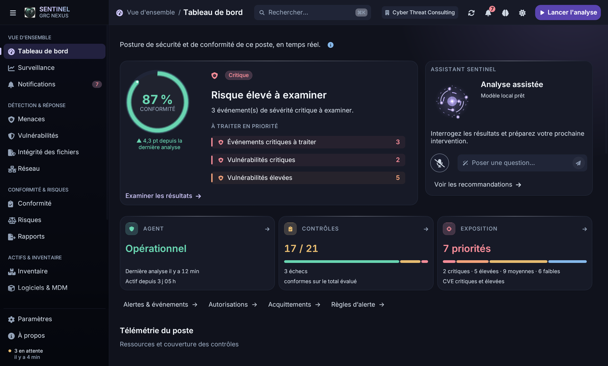

# Harmonie des couleurs et du mouvement

> **Mise à jour du 5 octobre 2026.** La palette désaturée décrite ci-dessous (iris `#5944B0`, menthe, ambre et corail adoucis, graphite `#10121C`) a été jugée terne à l'usage. Le thème est revenu à la palette saturée du site (violet `#6D28D9`, états vifs, encre `#070A12`) ; les effets et animations de cette passe sont conservés. Les captures de ce dossier montrent l'ancienne palette.

Seconde passe sur la GUI desktop, après la recomposition du dashboard.

## Palette

Graphite plus lumineux (`#10121C`), cartes en encre (`#171A27`) et surfaces de contrôle (`#202537`). Les actions associent iris (`#5944B0`) et améthyste (`#6144A2`), avec une lavande claire pour leurs libellés sur fond sombre. La signature typographique utilise désormais une seule famille froide, perle/lavande/bleu acier.

Les états sombres utilisent menthe, ambre et corail moins saturés. Le thème clair conserve des variantes foncées calibrées pour le texte. La correspondance sémantique suit directement les tokens de couleur, sans anciennes valeurs RGB figées. Les chiffres du terminal et l'arc de conformité utilisent aussi la variante lisible du thème.

## Effets et animations

- Cartes interactives : reflet localisé le long du bord supérieur, suivant horizontalement le pointeur avec amortissement. Le contour apparaît progressivement.
- Boutons : léger enfoncement visuel (moins d'un point) pendant la pression, sans déplacement de la zone cliquable ni de la mise en page.
- Navigation et onglets : déplacement amorti, sans dépassement, poursuivant le mouvement depuis la position courante quand la cible change.
- Jauge : interpolation de l'arc uniquement lorsqu'un score change. Le nombre affiché reste la valeur mesurée ; la première valeur apparaît directement.
- Assistant : halo à décroissance radiale continue, sans disque lumineux à contour dur. Animation réservée à l'activité réelle, comme dans la première passe.
- Détail : entrée courte avec montée et assombrissement progressif de l'arrière-plan, initialisée dès la première ouverture.
- Mouvement réduit : déplacement et enfoncement supprimés, états immédiatement visibles. Pas d'animation permanente ajoutée au repos.

## Validation

**168 tests réussis**, incluant contrastes des textes, états, bordures et les deux extrémités du dégradé d'action. Trois tests supplémentaires vérifient l'amortissement : interruption sans dépassement, même déplacement à 60/120 Hz, initialisation et mouvement réduit instantanés. [Journal](tests.log).

Banc de rendu : 42 vues/onglets en sombre à 1360 points et en clair à 800 points, avec données de démonstration, plus la palette dans chaque configuration. Aucun débordement ou blocage du défilement détecté dans ces 86 contrôles. Les deux dernières corrections de couleur (jauge et valeur du terminal) ont ensuite été couvertes par les tests unitaires et la capture claire finale ; elles ne changent pas la géométrie. [Sombre](layout-dark.log), [clair](layout-light.log).

Compilation des aperçus, formatage et vérification du diff réussis. Captures natives macOS relues : [sombre](dark.png), [clair](light.png), [détail](detail.png). Les captures sont statiques ; les tests du mouvement vérifient ses propriétés numériques, pas la fluidité GPU en production. Les limites d'intégration de la première passe restent applicables.

