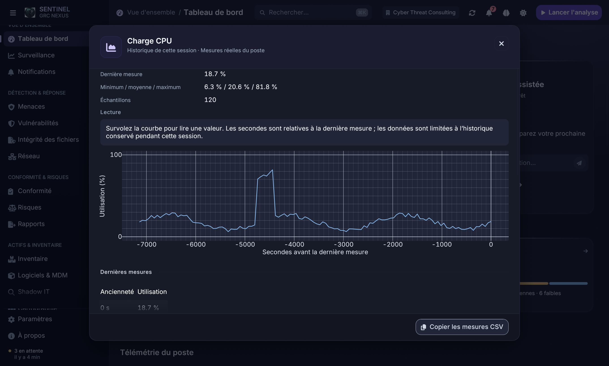
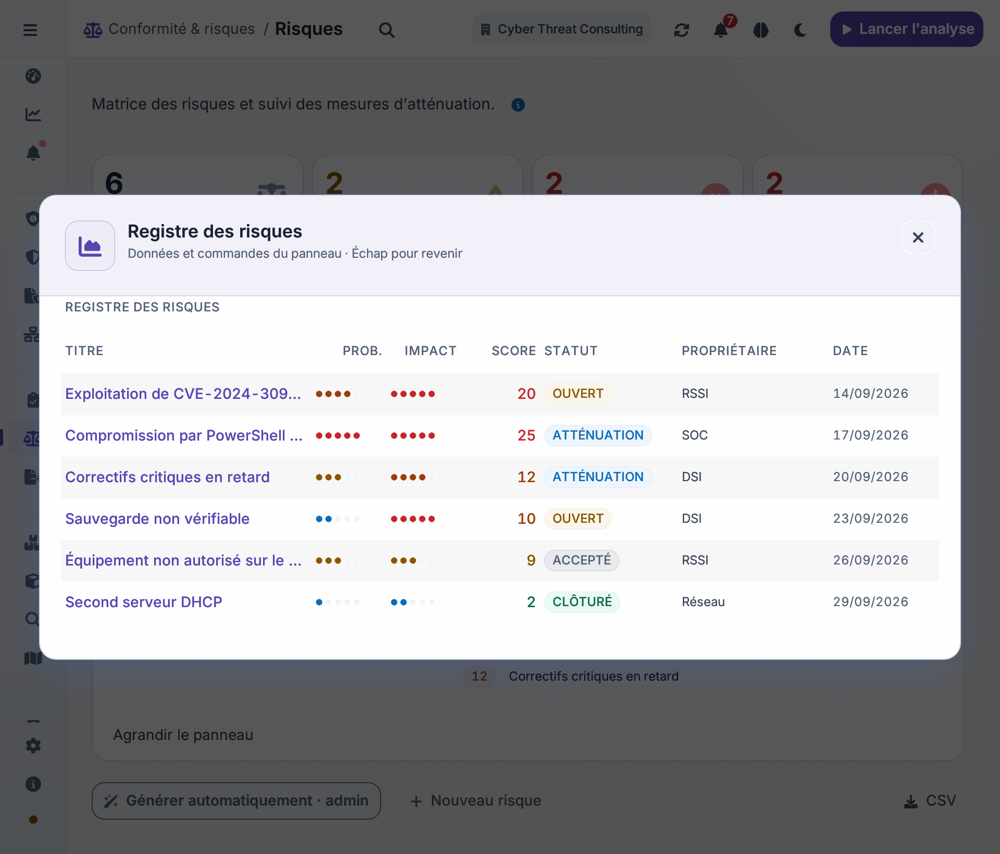
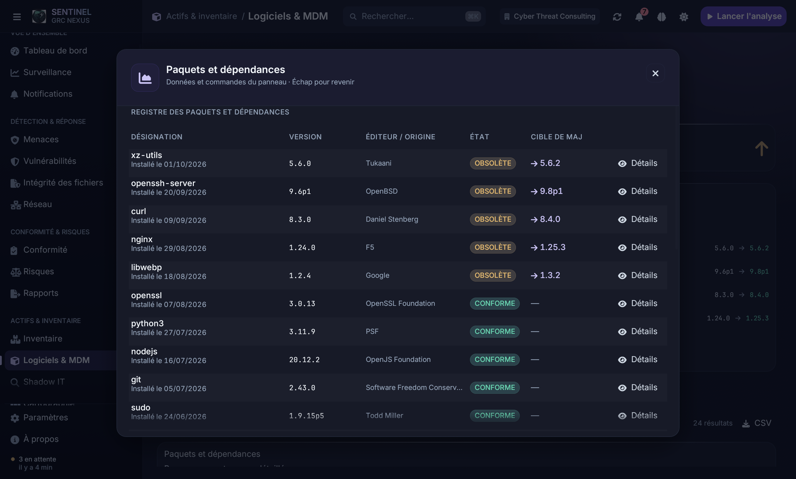
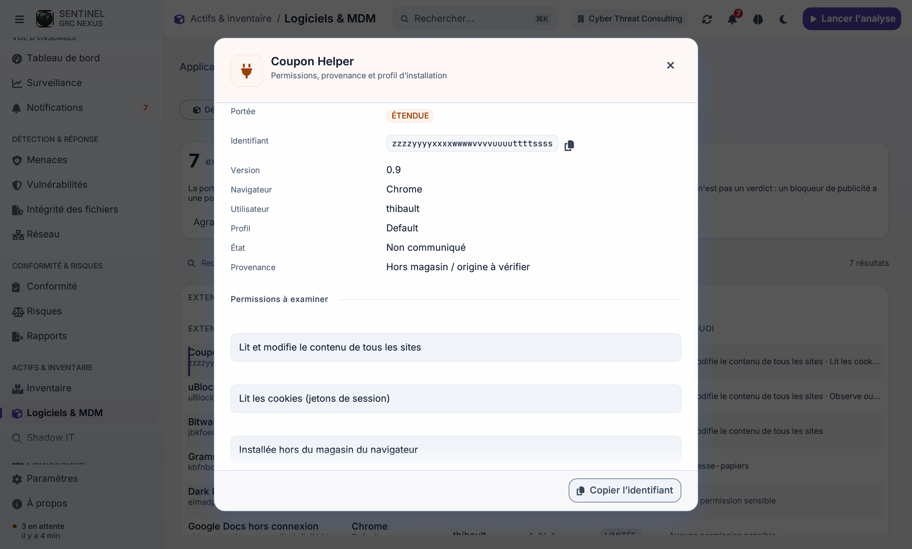

# Cartes et indicateurs interactifs — 4 octobre 2026

85 emplacements de panneaux utilisent désormais le composant `data_card` : clic sur le fond, bouton « Agrandir le panneau », ouverture au clavier et retour par Échap. Le panneau ouvert conserve ses données vivantes et ses commandes : le contenu n’est exécuté qu’une fois par passe de rendu. Les boutons, champs, tableaux et graphiques internes gardent la priorité sur le fond de carte.

## Accès aux informations

| Élément | Résultat |
|---|---|
| CPU / mémoire du tableau de bord | Courbe de la session, minimum, moyenne, maximum, 20 dernières mesures, copie de l’historique en CSV. État d’attente explicite sans télémétrie. |
| Priorités du diagnostic | Navigation vers menaces, vulnérabilités ou conformité selon la ligne choisie. |
| Recommandation du tableau de bord | Fiche de la recommandation sélectionnée dans l’assistant. |
| Compteurs de conformité | Contrôles filtrés par statut, dans leur panneau détaillé. |
| Compteurs de vulnérabilités | Liste filtrée par gravité, recherche et pagination réinitialisées. |
| Compteurs d’actifs | Inventaire filtré par criticité ou cycle de vie. |
| Compteurs de risques | Registre complet, ouvert, critique ou en dépassement de SLA. |
| Cellule de la matrice des risques | Registre filtré par probabilité et impact ; filtre effaçable. |
| Compteurs réseau | Section interfaces, connexions ou alertes correspondante. |
| Extensions de navigateur | Fiche individuelle : permissions, provenance, état, profil, utilisateur et identifiant copiable ; sélection clavier paginée. |
| Compteur d’erreurs du terminal | Journal filtré sur les erreurs. |
| Panneaux SIEM, FIM, logiciels, découverte, audit, rapports, synchronisation, paramètres et IA | Vue agrandie avec les données, graphiques, tableaux et actions existants. |

Les formulaires, confirmations, filtres et états vides restants conservent leurs commandes dédiées. Les actions nécessitant des droits administrateur gardent les mêmes vérifications. L’ouverture d’un panneau ne lance aucune action de remédiation. Les fonctions d’IA dépendent toujours des modules réellement disponibles dans la version de l’agent.

## Vérification

- `cargo test --offline -p agent-gui --lib` : **174 tests réussis**. Régressions couvrant clic enfant / fond, exécution unique du contenu, commande dans le panneau ouvert, ouverture Entrée, fermeture Échap et filtrage des risques (criticité, SLA, matrice).
- Construction des exemples natifs `preview` et `scroll_probe` réussie avec les fonctionnalités par défaut.
- 42 pages/onglets × 4 configurations : sombre 1360 avec données, clair 800 avec données, sombre 800 vide, clair 1360 vide. Aucun débordement horizontal ni défilement bloqué détecté ; palette vérifiée dans chaque configuration.
- 22 scénarios de panneaux ouverts × 2 configurations (sombre 1360, clair 800) : **44 ouvertures persistantes vérifiées**, dont l’inventaire des extensions.
- Aperçus natifs inspectés : tableau de bord, historique CPU, registre des risques à 960 px en clair, tableau des paquets en sombre, fiche d’extension en clair.
- Formatage Rust et `git diff --check` réussis.

Ces vérifications utilisent les données de démonstration du banc d’aperçu. Elles ne constituent pas un essai de remédiation ou de connexion aux services de production. La compilation `--all-features` n’a pas été répétée : le SDK Metal manquant avait déjà été identifié lors de la passe visuelle précédente.

## Aperçus









## Reproduction

```sh
cargo test --offline -p agent-gui --lib
cargo build --offline -p agent-gui --example preview --example scroll_probe
PROBE_DETAILS=1 target/debug/examples/scroll_probe
PROBE_DETAILS=1 PROBE_LIGHT=1 PROBE_W=800 target/debug/examples/scroll_probe
PREVIEW_PAGE=dashboard PREVIEW_DATA=1 PREVIEW_RESOURCE=cpu target/debug/examples/preview
PREVIEW_PAGE=risks PREVIEW_DATA=1 PREVIEW_PANEL='Registre des risques' target/debug/examples/preview
PREVIEW_PAGE=software PREVIEW_DATA=1 PREVIEW_TAB=2 PREVIEW_DRAWER=extension target/debug/examples/preview
```
